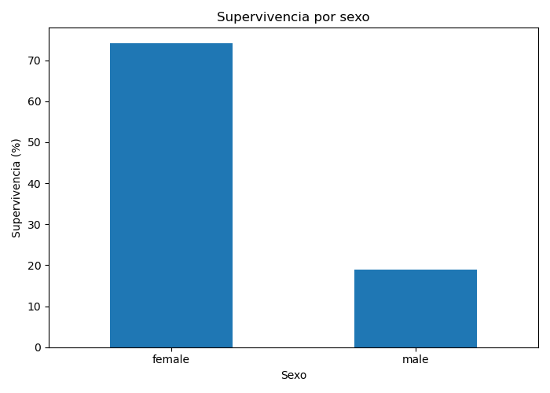
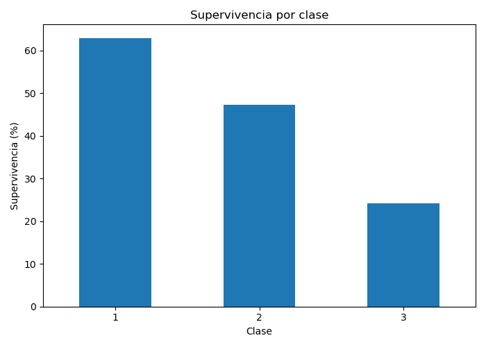
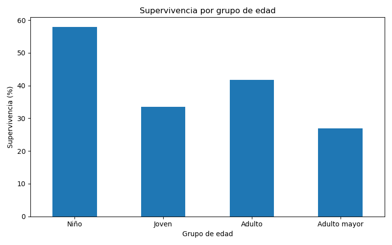
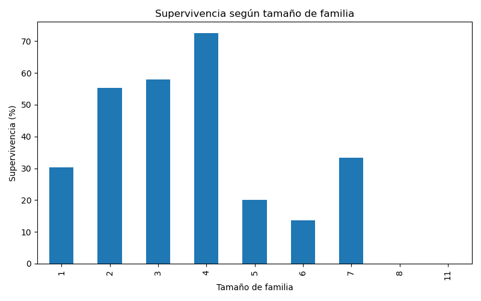
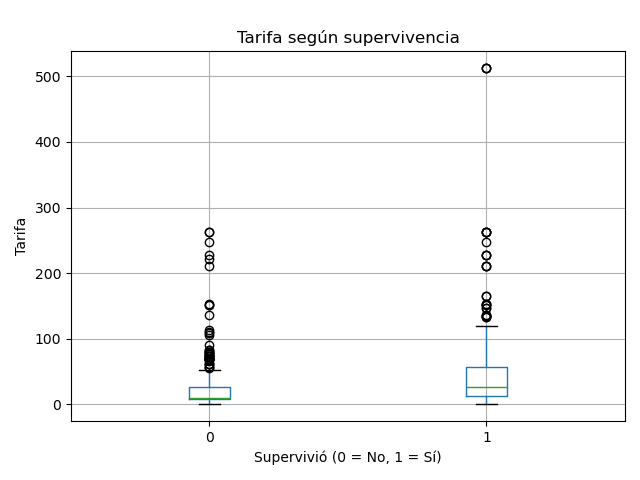

# Análisis de pasajeros del Titanic

Análisis exploratorio del dataset del Titanic de Kaggle. El objetivo es ver qué características de los pasajeros (sexo, clase, edad, familia y tarifa) se relacionan con la supervivencia.

El proyecto hace limpieza de datos, crea variables nuevas, calcula tasas de supervivencia por grupo y genera gráficas. No usa Machine Learning.

## Estructura del proyecto

```
titanic-analisis/
├── data/
│   └── train.csv              # Dataset original (891 pasajeros)
├── src/
│   └── analysis.py            # Script principal del análisis
├── outputs/
│   └── resultados/            # Tablas, gráficas y conclusiones generadas
├── requirements.txt           # Librerías necesarias
└── README.md
```

## Requisitos

- Python 3.12 o superior
- Git

## Instalación y ejecución

1. Clonar el repositorio:

   ```bash
   git clone https://github.com/xXAdrianCanoXx/titanic-analisis.git
   cd titanic-analisis
   ```

2. Crear y activar un entorno virtual:

   ```bash
   python -m venv .venv
   ```

   - Linux / macOS: `source .venv/bin/activate`
   - Windows: `.venv\Scripts\activate`

3. Instalar las dependencias:

   ```bash
   pip install -r requirements.txt
   ```

4. Ejecutar el análisis desde la carpeta principal del proyecto:

   ```bash
   python src/analysis.py
   ```

El script muestra los resultados en la terminal y guarda los archivos en `outputs/resultados/`.

## Qué hace el script

1. **Carga y exploración:** número de registros, tipos de datos, valores faltantes y duplicados.
2. **Limpieza:**
   - `Age`: los valores faltantes se llenan con la mediana según sexo y clase.
   - `Cabin`: se convierte en `HasCabin` (1 si tenía cabina registrada, 0 si no), porque falta en la mayoría de los registros.
   - `Embarked`: los valores faltantes se llenan con el puerto más frecuente.
3. **Variables nuevas:**
   - `FamilySize`: hermanos/pareja + padres/hijos + el propio pasajero.
   - `TravelAlone`: "Solo" o "Acompañado".
   - `AgeGroup`: Niño (0–12), Joven (13–29), Adulto (30–59), Adulto mayor (60+).
   - `FareGroup`: tarifa dividida en cuartiles (Baja, Media-baja, Media-alta, Alta).
4. **Análisis:** tasa de supervivencia por cada grupo.
5. **Resultados:** guarda el dataset limpio, las tablas en CSV, las gráficas en PNG y un archivo de conclusiones.

## Resultados principales

Supervivencia general: **38.4%**

| Variable | Grupo | Supervivencia |
|---|---|---|
| Sexo | Mujeres | 74.2% |
| | Hombres | 18.9% |
| Clase | Primera | 63.0% |
| | Segunda | 47.3% |
| | Tercera | 24.2% |
| Edad | Niño | 58.0% |
| | Joven | 33.6% |
| | Adulto | 41.7% |
| | Adulto mayor | 26.9% |
| Viaje | Acompañado | 50.6% |
| | Solo | 30.4% |
| Tarifa | Baja | 19.7% |
| | Media-baja | 30.4% |
| | Media-alta | 45.5% |
| | Alta | 58.1% |

### Gráficas







## Conclusiones

- Las mujeres sobrevivieron mucho más que los hombres (74.2% contra 18.9%).
- La clase influyó: primera clase tuvo la mayor supervivencia y tercera la menor.
- Los niños tuvieron la mayor supervivencia entre los grupos de edad; los adultos mayores, una de las más bajas.
- Viajar acompañado se asocia con más supervivencia, aunque las familias muy grandes tuvieron tasas bajas.
- A mayor tarifa, mayor supervivencia.

Estos resultados muestran asociaciones dentro de los datos, no relaciones de causa y efecto. Las conclusiones completas están en `outputs/resultados/conclusiones.txt`.

## Archivos generados

| Archivo | Contenido |
|---|---|
| `titanic_limpio.csv` | Dataset después de la limpieza, con las variables nuevas |
| `supervivencia_por_*.csv` | Tasas de supervivencia por grupo |
| `*.png` | Gráficas del análisis |
| `conclusiones.txt` | Resumen escrito de los resultados |

## Fuente de los datos

Dataset `train.csv` de la competencia [Titanic - Machine Learning from Disaster](https://www.kaggle.com/competitions/titanic/data) de Kaggle.

## Autor

Adrian Cano — [@xXAdrianCanoXx](https://github.com/xXAdrianCanoXx)
